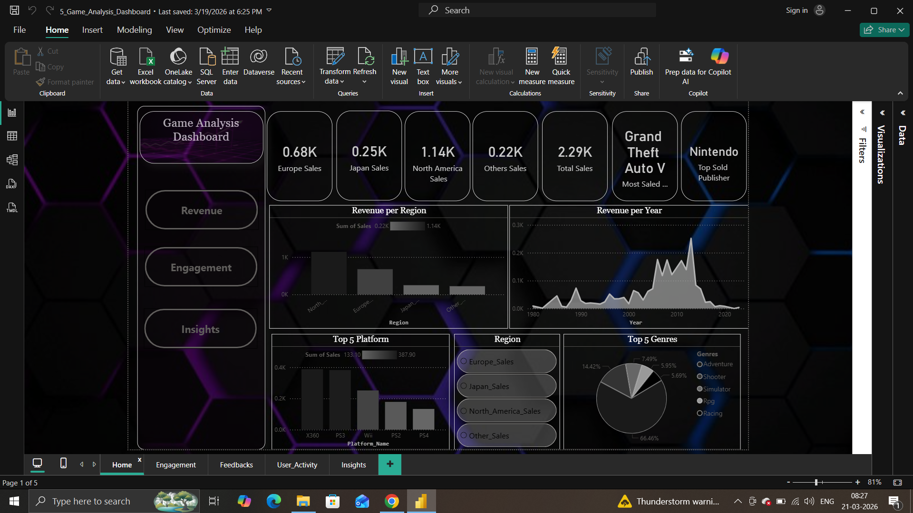
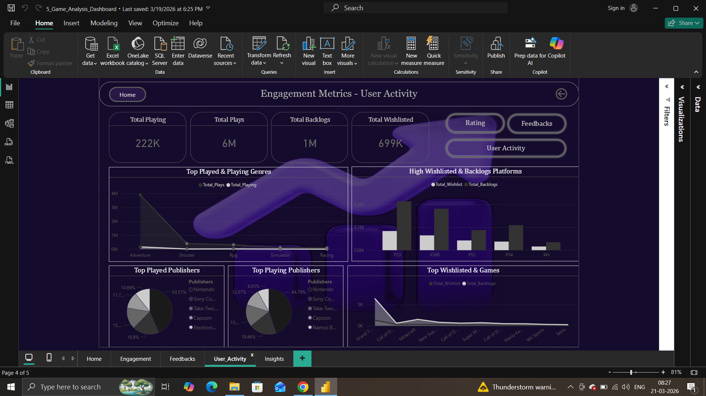
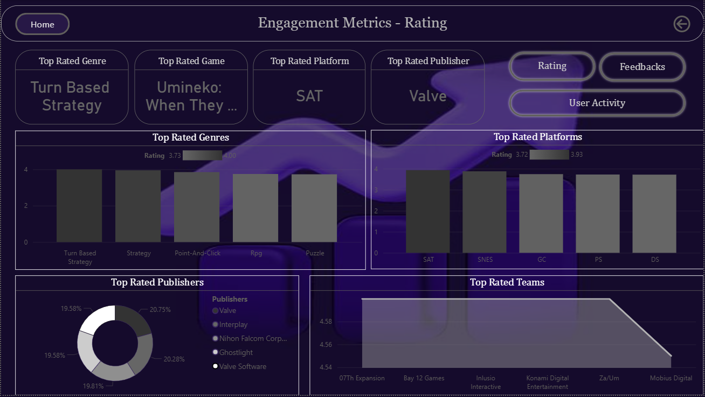
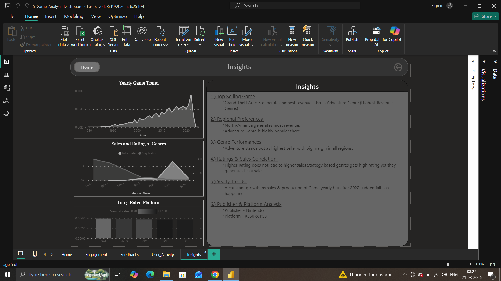

# 💻 Game : Sales & Engagement Optimization
Analyzed and visualized the video game sales and engagement data to uncover trends in game popularity, user behavior, and platform performance by merging sales and engagement data.

 

## 📌 Problem Statement 
To Clean & Standardize the data in Dataset and enforcing the relationship between tables and then analyze and visualize the video game sales and engagement data to uncover trends in game popularity, user behavior, and platform performance and make a interactive user friendly Dashboard.

 

## 🏢 Dataset 
- Data : VG Sales & Engagement Data (1980 -2025) [Dataset](Game_Analysis/1_Raw_Dataset)
- Source : Kaggle
- Size :  
    - Games Meta → 1512 rows & 14 columns.
    - Games Sales → 16598 rows & 11 columns.
- Fields : 
    - Games Meta →  Team,Release_Date,Team,Rating etc.
    - Games Sales → Name ,Platform ,Genre ,Publisher ,Region Sales etc.

 

## 🧹 Data Cleaning & Preparation 
### --> Games Meta :- 
  - Changed Data type of 7 fields (Release Date,Times Listed,Number of Reviews,Plays,Playing,Backlog,Wishlist) for accurate analysis.
  - Converted the Values of columns (Number of Reviews,Plays,Playing,Backlog,Wishlist by replacing {K,M,comma}).
  - Exploded Team & Genre Fields by unpivoting them.
  - Standardized Column names & their records following by removing duplicates.
  - Replacing null values in Rating with their respective genres average rating.

### --> Games Sales :-
  - Converted Data type of Year from float to int for better calculated analysis.
  - Replaced null values from Publisher to ‘Unknown’ .
#### Cleaned Dataset : [Cleaned Dataset](Game_Analysis/3_Cleaned_Dataset)
#### Python Notebooks : [Python Notebooks](Game_Analysis/2_Python_Notebooks)

 

## 🔁 Data Pre-Processing / Transformation 

- Split & transformed the cleaned 2 Dataset (csv files) in to 8 tables and enforced the primary keys and unique keys in them for maintaining relationship.
  - Fact Tables : Sales & Games
  - Dimension Tables : Genres,Platforms,Publishers,Teams,Game_genres,Games_Teams
- Inserted Cleaned records from Sales and Games Cleaned CSV files in to tables  

#### SQL Queries : [Queries](Game_Analysis/4_SQLQueries)

 

## 📈 Exploratory Data Analysis (EDA)
- Adventure Genre genrates 66 % of overall sales.
- X360 and PS3 produces highest sales across all platforms.
- Sales peaked during 2006 - 2013 Years.
- Total Sales is done 2.29k.
- Strategy based games have highest rating (4.0).
- More than 40% of users has played and playing on Nintendo Publisher.

 

## 🏨 Dashboard / Visualization 
Click on Images to get Bigger Picture

### Tool Used : PowerBI
### Key Measures Used : 
- Top Selected or Overall Platform (Returns the Platform which is Highest in Sales)
- Highest Selling game
- Top Publisher & Team

[Dashboard File](Game_Analysis/Game_Analysis_Dashboard.pbix)

 

## 🎯 Insights 
- ### GTA 5 generates the highest sales in overall games.
- ### Genre Term : Adventure stands out as the most successful Genre based on Sales,Regions,feedbacks,active & inactive users.
- ### Yearly Trend :
  - 2006 - 2013 was the peak time of Sales globally.
  - After year 2022 the production of games slowed down drastically.
- ### Publishers & Platform :
    - Publisher : 
        - Nintendo (Sales) 
        - Valve (Rating)
    - Platform :
        - X360 & PS3 (Sales)
        - SAT (Rating)

 

## 🗣 Recommendations 
- Company must consider those Budget games which can be accessible on X360 or PS3 Platforms and focus more on Adventure Genre.
- Adventure Genre games should make some updates by putting Strategies & Puzzles in their games with a storyline making them good in rating too.
- Advertise more in Japan and Europe as they produce less sales.

 

### If need more Details here you can check Project PPT File also. 
[PPT File](Game_Analysis/Games_Analysis_Presentation.pptx)

 

## ⚙ Tech Stack 
- Python (Numpy,Pandas)
- SQL
- PowerBI (DAX Queries)

 

## 🛠 Tool Stack 
- VS Code & Jupyter Notebook (Data Cleaning & Preparation) 
- SQL Server Management Studio (SSMS) - (Creating Tables & Relationship)
- Microsoft PowerBI (Dashboard Visualization)

 

## 

 

## Contact - Dhruv Sikarwar (Author)
- [Connect With me on LinkedIn](https://www.linkedin.com/in/dhruv-sikarwar-b2477a30b)

